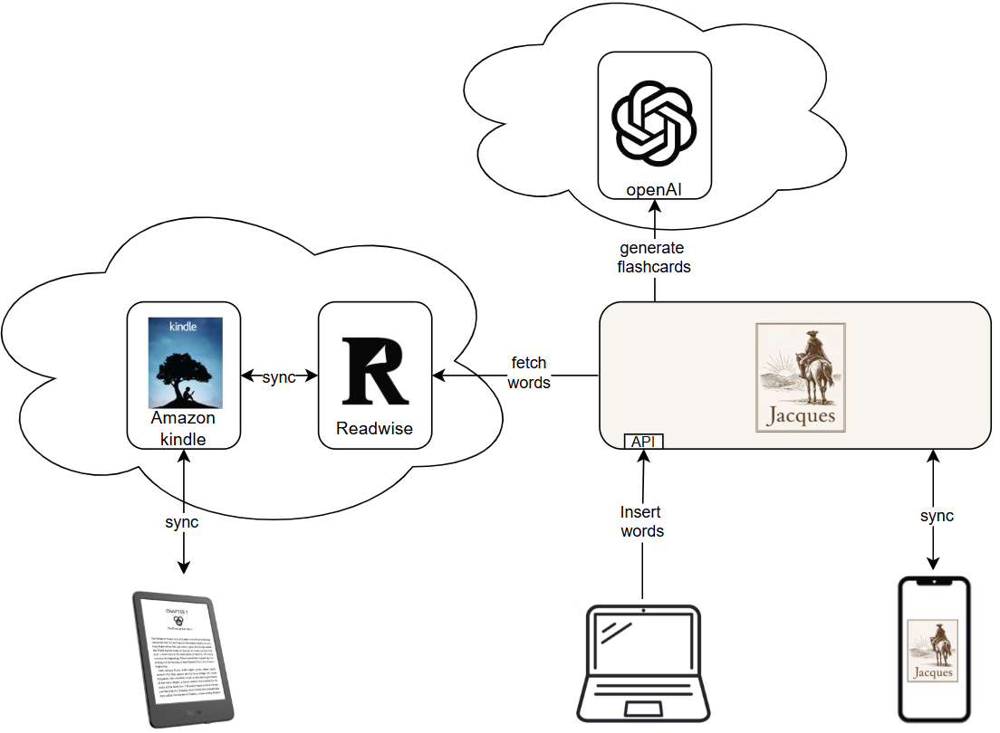
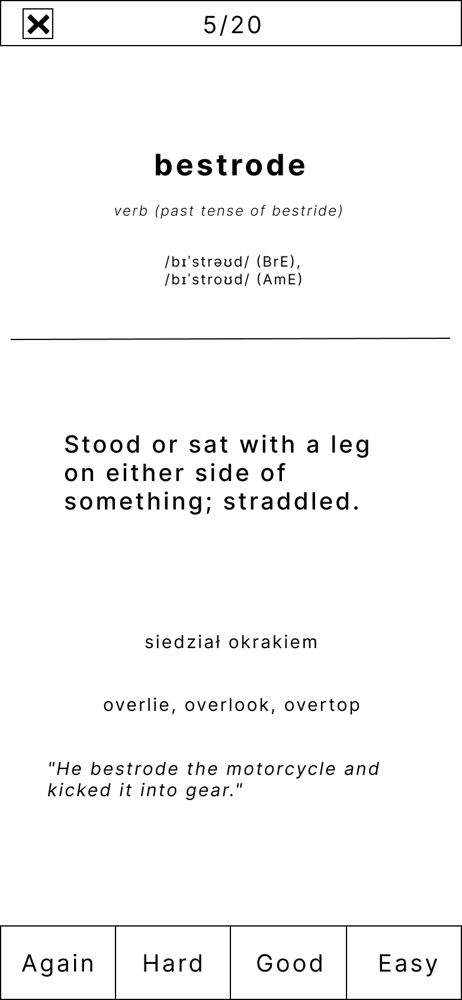

  <i>A zero-touch spaced repetition app that learns you English</i

# Zen of Jacques

- Z.1 Aplikacja ma być niemalże seamless dla usera, zero zarządzania procesem nauki. Słówka ładują się same z zaznaczeń w Book-Readerach. O tym co powtarzać decyduje algorytm spaced repetition. Jedyne kiedy user musi aktywnie pomyśleć o Jacques to podczas otwierania aplikacji na telefon.
- Z.2 Otwierania aplikacji na telefon jest atrakcyjne dla usera, czeka go tam feed z powtórką słówek, propozycjami słówek, snippetami zasad z gramatyki.
- Z.3 Aplikacja nie zamyka furtki dla bardziej zaagnażowanych userów. Słówka można wpisywać samemu.
- Z.4 Fiszki są bardzo rozbudowane zawierają definicję, wymowę (IPA), przykłady synonimy (patrz obrazek niżej).

# Architektura

# Przykładowa fiszka (wireframe)

